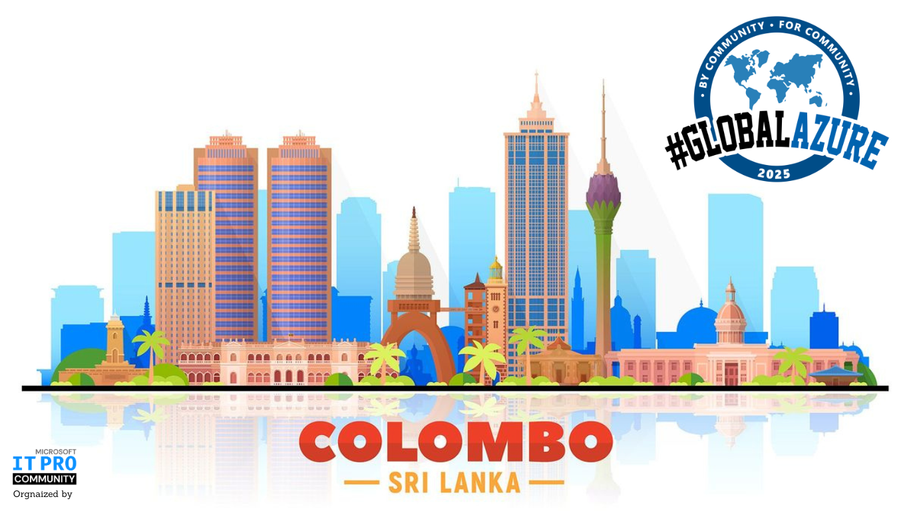

# Global Azure Colombo by Microsoft IT Pro Community - Sri Lanka

Global Azure Colombo is a community event organized by the Microsoft IT Pro Community - Sri Lanka.

All around the world user groups and communities are sharing knowledge to professionals that want to learn more about Microsoft Azure and Cloud Computing!

On May 10, 2025, we will come together to once again bring the Global Azure event! The Microsoft IT Pro Community - Sri Lanka brings a one-day world-class event on Microsoft Azure. Join us online and don't forget to use the social hashtags #ColomboGlobalAzure and #GlobalAzure!

The [Call for Speakers Opens on February 1st 2025.](https://sessionize.com//global-azure-boot-camp-colombo/).

Key information:
* 📅 May 10, 2025
* 🏠 Microsoft Sri Lanka Office
* 🎫 Get your FREE ticket - [Lu.ma](https://lu.ma/vchfokw5)

 🎙️ Call for speakers - [https://sessionize.com//global-azure-boot-camp-colombo/](https://sessionize.com//global-azure-boot-camp-colombo/)

* 💶 Sponsors - We are looking for sponsors. Reach out to the organization team at [hello@pathumudana.com](mailto:hello@pathumudana.com) [https://www.linkedin.com/company/microsoft-it-pro-community/](https://www.linkedin.com/company/microsoft-it-pro-community/)

If you have any questions, feedback or thoughts, please reach out to the community organizers at:
* https://www.linkedin.com/company/microsoft-it-pro-community/
* [hello@pathumudana.com](mailto:hello@pathumudana.com)
